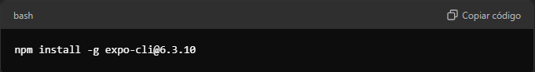
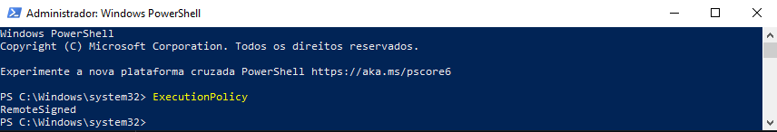
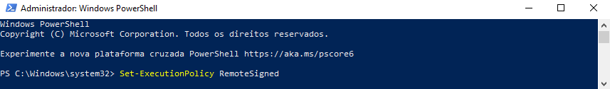
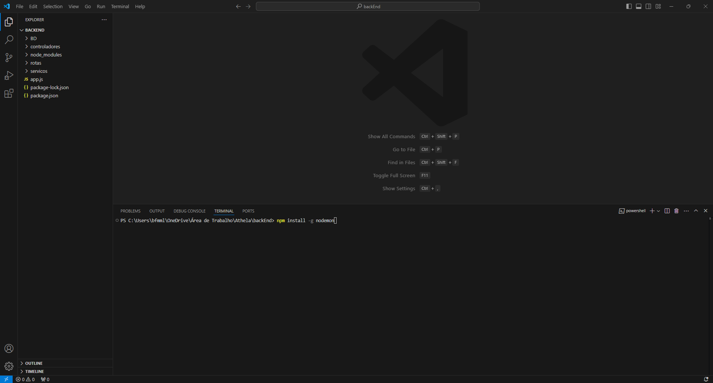
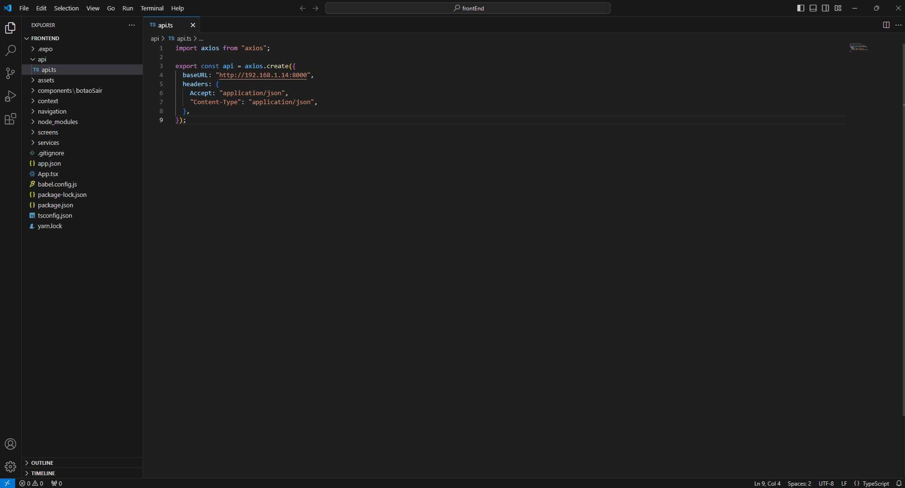

# Athela

## Passo a passo para rodar o projeto

### 1. Preparando o ambiente

1.1 - Caso não tenha o [node](https://nodejs.org) instalado na maquina, baixe a versão mais recente (20.17.0).

1.2 - Recomendo utilizar o [Visual Studio Code](https://code.visualstudio.com) como IDE. 

1.3 - Para instalar a versão do expo que utilizamos, abra o Prompt de Comando(cmd) e rode o comando "npm install -g expo-cli@6.3.10".

1.4 - No seu celular, acesse a loja (Apple Store ou Play Store) e instale o aplicativo "expo-go" para visualização do projeto.

1.5 - Antes de inicializarmos, abra o powershell como administrador na sua maquina e rode o comando "ExecutionPolicy" para verificar se já setado como "RemoteSigned".

Caso não, execute o comando "Set-ExecutionPolicy RemoteSigned".

1.6 - É necessário que tanto a máquina que está rodando as aplicações como o seu celular esteja na mesma rede Wifi.

1.7 - Clone ou baixe o repositório do projeto na sua máquina. 

### 2. Inicializando o backEnd 

2.1 - Na pasta do projeto, abra a pasta "backEnd" com o VScode, abra um terminal no mesmo e rode o comando "npm install -g nodemon".

2.2 - Rode também o comando "npm install" para baixar as dependencias do projeto. 

2.3 - Inicialize o projeto com "nodemon app.js" e deixe o Vscode aberto.

### 3. Inicializando o frontEnd

3.1 - Abra outro Vscode com a pasta "frontEnd", nele abra um terminal e rode o comando "npm install" para instalar as dependencias do projeto.

3.2 - No cmd, rode o comando "ipconfig", e copie o Endereço IPv4 correspondente a sua máquina.

3.3 - Na pasta frontEnd vai ter uma pasta "api" com um arquivo "api.ts" dentro, nele você vai preencher a "baseURL" para "http://**ipDaSuaMaquina**:8000", ficando parecido com a imagem abaixo, preste atenção para manter o **:8000** pois é a porta que o backEnd estará rodando, depois disso salve o arquivo.

3.4 - No terminal do Vscode rode o comando "npx expo start --tunnel" para inicializar o frontEnd, ele gerará um qrcode, caso no aplicativo expo go não tenha a opção "Scan QR code" utilize a câmera do seu celular e aponte para o código. Pronto, você já pode desfrutar do Athela.
